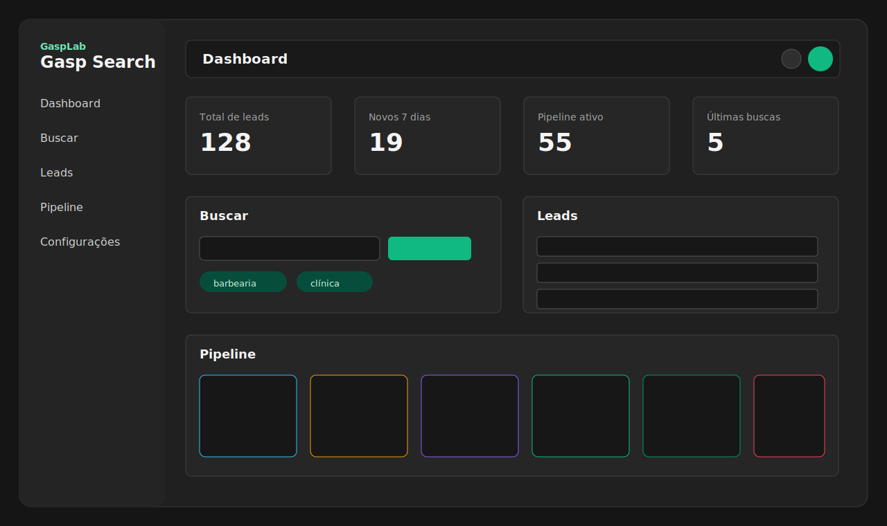

# Gasp Search

Aplicação web interna do GaspLab para captação, qualificação e gestão de leads voltada ao desenvolvimento de sites e automação para clientes.

> **Continuando o desenvolvimento?** Comece pelo [`HANDOFF.md`](./HANDOFF.md) — estado do projeto, próximos passos, dicas para retomada com qualquer agente AI (Codex, Claude, etc.) ou humano.
>
> Spec técnica em [`CLAUDE.md`](./CLAUDE.md). Workflow de PR em [`CONTRIBUTING.md`](./CONTRIBUTING.md). Backlog em [issues](https://github.com/gasparellodev/gasp-search/issues).



## Stack

- Next.js 16 App Router + React 19 + TypeScript strict
- Tailwind v4 CSS-first + shadcn/ui
- Supabase (Postgres, Auth, RLS)
- Apify (`apify-client`) para Google Maps, Instagram e enriquecimento
- Anthropic SDK (`claude-sonnet-4-6`) para geração de mensagens
- Vitest + React Testing Library + Playwright

## Setup

Pré-requisitos:

- Node 24 LTS
- Acesso ao projeto Supabase
- `gh` CLI autenticado para fluxo de PR/CI

```bash
npm install
cp .env.local.example .env.local
# preencher chaves Supabase / Apify / Anthropic
npm run dev
```

Variáveis obrigatórias em `.env.local`:

- `NEXT_PUBLIC_SUPABASE_URL`
- `NEXT_PUBLIC_SUPABASE_ANON_KEY`
- `SUPABASE_SERVICE_ROLE_KEY`
- `APIFY_TOKEN`
- `APIFY_GOOGLE_MAPS_ACTOR_ID`
- `APIFY_INSTAGRAM_ACTOR_ID`
- `APIFY_WEBSITE_CONTACT_ACTOR_ID`
- `ANTHROPIC_API_KEY`
- `ANTHROPIC_MODEL`
- `NEXT_PUBLIC_APP_URL`

Aplicar banco:

```bash
npx supabase login
npx supabase link --project-ref pvazzozzqwwshgacmafv
npx supabase db push
```

Ou cole as migrations de `supabase/migrations/` no SQL Editor do Supabase.

## Scripts

- `npm run dev` — servidor de desenvolvimento
- `npm run build` — build de produção
- `npm run lint` — ESLint
- `npm run typecheck` — TypeScript sem emitir arquivos
- `npm test` — Vitest unit/integration
- `npm run test:e2e` — Playwright E2E

## Telas

- `/login` — login por e-mail/senha e Google OAuth
- `/dashboard` — métricas, estágios e últimas buscas
- `/search` — busca Google Maps com polling de job e redirecionamento para leads
- `/leads` — tabela paginada, filtros, tags, enriquecimento e drawer de detalhe
- `/pipeline` — Kanban responsivo com atualização otimista de estágio
- `/settings` — preferências da conta

## Contribuindo

Veja [`CONTRIBUTING.md`](./CONTRIBUTING.md) para o fluxo de PR e gates de merge.
